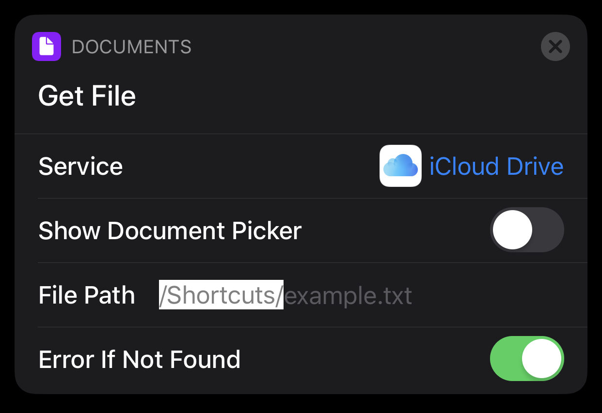

# Current Task  
Current Task is a small utility I use to focus on one task at a time. It relies on Alfred, KeyboardMaestro, BetterTouchTool (BTT), Timing and Focus apps. It stores the current task I am working on in iCloud's Siri Shortcuts folder that I could access it on all my macOS and iOS devices.

The task is created using Alfred workflow, which enables Focus app for 25 minutes (Pomodoro) to block distractions, and opens the Timing Menu to confirm the task. BTT reads the file and shows the Current Task on Touch Bar. 

When I finish working on the task I just press on it on the Touch Bar. BTT action clears the file, disables Focus and marks Timing task as completed. The is also a "stop task" action in the Workflow.

Since the Current Task is stored in a simple file, any app can easily access it. There is a Keyboard Maestro macro
that opens a palette with a different Current Task filtering options. I.e. you can insert Current Task in a line-separated-style which is very handy when creating new features in  [git flow](https://github.com/petervanderdoes/gitflow-avh).

Below you will find a list of all integrations I've made so far. I will be adding more integrations over time.

## Alfred Workflow
 [Download workflow](https://github.com/skibitsky/current-task/raw/master/alfred-workflow/current-task-v1.1.alfredworkflow)
 

The workflow allows to create and close tasks. Creation is possible by  calling workflow directly (I use Karabiner Elements and Goku for that, my config can be found  [here](https://github.com/skibitsky/dotfiles/blob/master/karabiner/karabiner.edn)) or by selecting the text anywhere (i.e. inside task tracking app or GitHub issue) and using hotkey. 

## BetterTouchTool
Shows Current Task on MacBook's Touch Bar.

This is how my Touch Bar looks like with the active Current Task on the left:

Setup instruction can be found [here](https://github.com/skibitsky/current-task/tree/master/btt).

## Keyboard Maestro
 [Download macro group](https://raw.githubusercontent.com/skibitsky/current-task/master/keyboard-maestro/current-task-macros.kmmacros)
 
Allows to insert Current Task and apply filters to it.

## Siri Shortcuts
I am looking for the best use-case here. The fact that Current Task is stored in Siri Shortcuts folder means that Current Task can be accessed by any shortcut using `Get File` action:

 

---
Inspired by  [nikitavoloboev](https://github.com/nikitavoloboev)'s [TODO Task](https://github.com/nikitavoloboev/small-workflows/tree/master/todo-task#readme) workflow.
